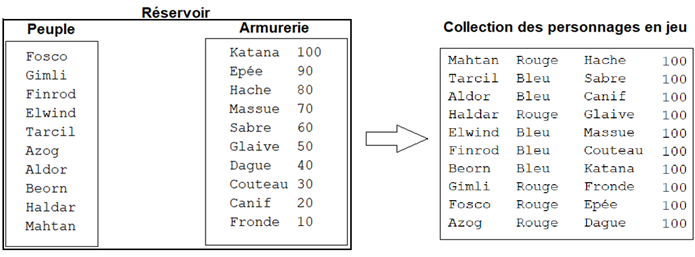
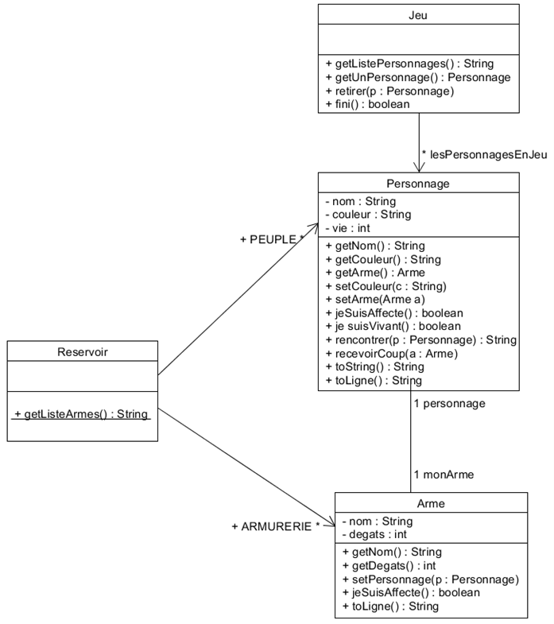
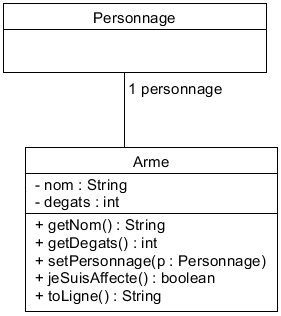
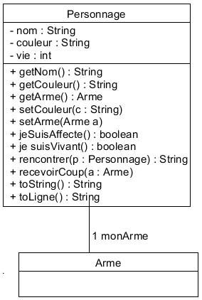
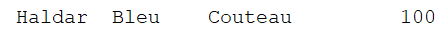
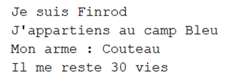
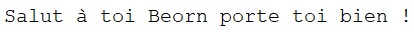
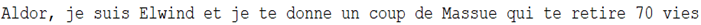
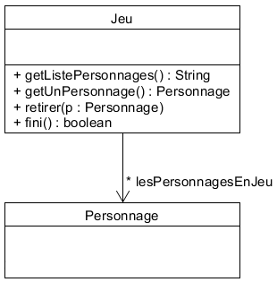

# Jeu de combat pour révisions de POO

**Au départ étaient un peuple et des armes !**

**… il ne doit en rester qu'un…**

A notre disposition un peuple de 10 personnages et une armurerie de 10 armes. Le jeu va affecter à chacun des personnages du peuple :

- une couleur de camp Bleu ou Rouge aléatoirement,

- une arme de l'armurerie aléatoirement,

- un quota de vie à 100.

Une fois affectés de leur couleur et armés, les personnages sont versés dans la collection des personnages en jeu.

Ensuite le jeu va déclencher une rencontre entre 2 personnages p1 et p2 aléatoirement dans la collection des personnages encore en jeu. Les règles de gestion sont les suivantes :

- Dans tous les cas, les personnages se présentent,

- Si p1 et p2 sont de la même couleur alors p1 salue p2,

- Si p1 et p2 sont de couleur différente alors p1 donne un coup de son arme à p2 ce qui lui enlève des vies en fonction des dégâts causés par son arme. Si le nombre de vie atteint 0, le coup est fatal et le personnage est retiré de la collection des personnages en jeu,

- Puis on recommence avec une nouvelle rencontre, Le jeu se termine lorsqu'il n'y a plus qu'un seul personnage en jeu ou alors lorsque tous les personnages sont de la même couleur.

Voici le diagramme de classes de notre jeu :

## La classe Reservoir :

> **Consigne**
> Ajouter au projet la classe Reservoir.java qui vous est fournie dans le dossier sujet&classes_fournies/classes.

## La classe Arme :

Le constructeur reçoit 2 paramètres (nom et dégâts) et l'attribut personnage est affecté à null,

Le personnage sera affecté par la méthode **setPersonnage(),**

La méthode **jeSuisAffecte()** renvoie faux si l'attribut personnage est affecté à null, vrai sinon,

La méthode **toLigne()** renvoie une description de l'arme conforme à l'exemple suivant :

> **Consigne**
> Ecrire la classe Arme et dans le programme principal, créer 2 armes a1 (katana 100) et a2 (canif 20), affichez-les sous la forme de ligne puis indiquez si a2 est déjà affecté.

## La classe Personnage :

Le constructeur reçoit 1 paramètre (nom), l'attribut vie est automatiquement initialisé à 100 et les attributs couleur et monArme sont affectés à null,

La méthode **jeSuisAffecte()** renvoie faux si la valeur de l'attribut couleur est null, vrai sinon,

Les méthodes **setCouleur()** et **setArme()** permettront d'affecter la couleur et l'arme,

La méthode **toLigne()** renvoie une description en ligne du personnage conforme à l'exemple suivant :

La méthode **toString()** renvoie une description du personnage conforme à l'exemple suivant :

La méthode **jeSuisVivant()** renvoie vrai si l'attribut vie est supérieur à 0, faux sinon,

La méthode **rencontrer()** renvoie une chaine de caractère qui résume ce qui s'est passé pendant la rencontre :

- Dans tous les cas, les personnages se présentent, appel de la méthode **toString()** des 2 Personnages,

- Si p1 et p2 sont de la même couleur alors p1 salue p2, par exemple :

- Si p1 et p2 sont de couleur différente alors p1 donne un coup de son arme à p2 ce qui lui enlève des vies en fonction des dégâts causés par son arme et annonce :

- La méthode **recevoirCoup()** retire des vies au personnage en fonction des dégâts de l'arme qui porte le coup.

> **Consigne**
> Ecrire la classe Personnage et dans le programme principal, créer 2 personnages p1 et p2 :
> 
> - affectez à l'arme a1 le personnage p1 (2 actions),
> - affectez à l'arme a2 le personnage p2 (2 actions),
> - affichez-p1 et p2 sous la forme de ligne,
> - affichez la présentation de p1 et p2,
> - affichez la rencontre entre p1 et p2,
> - testez si p2 est toujours vivant.

## La classe Jeu :

Le constructeur instancie la collection lesPersonnagesEnJeu. On tire au sort un personnage du peuple du réservoir et on lui affecte aléatoirement une couleur (bleu ou rouge) ainsi qu'une arme issue de l'armurerie du réservoir. On fait de même pour les 9 autres personnages…

La méthode **getListePersonnage()** retourne la liste des personnages en jeu sous la forme d'une chaîne de caractères :

La méthode **getUnPersonnage()** tire au sort l'un des personnages de la collection lesPersonnagesEnJeu.

La méthode **retirer()** supprime le personnage passé en paramètre de la collection lesPersonnagesEnJeu, pour être sûr, on vérifie avant que le personnage, n'est plus vivant.

La méthode **fini()** vérifie renvoie vrai si l'une de ces 2 conditions est vérifiée, faux sinon :

- il ne reste qu'un seul personnage dans la collection,

- les personnages de la collection sont tous du même camp.

> **Consigne**
> Ecrire la classe Jeu,
> 
> Testez en remplaçant votre actuel programme principal par celui fourni dans le dossier `sujet&classes_fournies/classes`.
