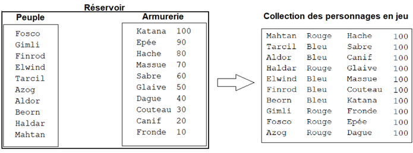
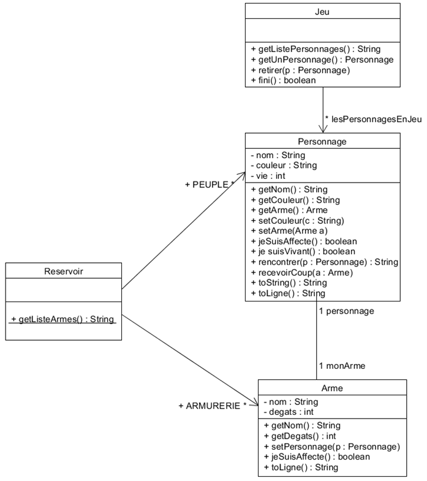
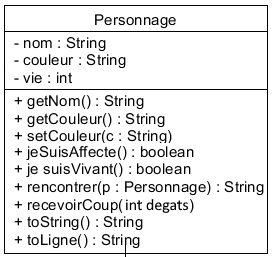
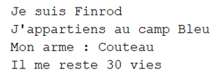
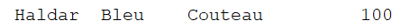
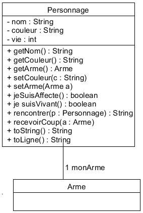
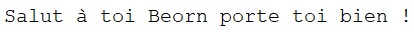
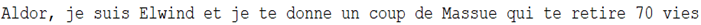
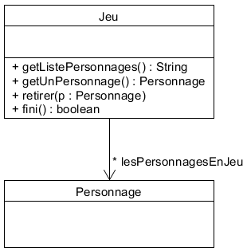

# Jeu de combat pour révisions de POO

**Au départ étaient un peuple et des armes !**

**… il ne doit en rester qu'un…**

A notre disposition un peuple de 10 personnages et une armurerie de 10 armes. Le jeu va affecter à chacun des personnages du peuple :

- une couleur de camp Bleu ou Rouge aléatoirement,

- une arme de l'armurerie aléatoirement,

- un quota de vie à 100.

Une fois affectés de leur couleur et armés, les personnages sont versés dans la collection des personnages en jeu.

Ensuite le jeu va déclencher une rencontre entre 2 personnages p1 et p2 aléatoirement dans la collection des personnages encore en jeu. Les règles de gestion sont les suivantes :

- Dans tous les cas, les personnages se présentent,

- Si p1 et p2 sont de la même couleur alors p1 salue p2,

- Si p1 et p2 sont de couleur différente alors p1 donne un coup de son arme à p2 ce qui lui enlève des vies en fonction des dégâts causés par son arme. Si le nombre de vie atteint 0, le coup est fatal et le personnage est retiré de la collection des personnages en jeu,

- Puis on recommence avec une nouvelle rencontre, Le jeu se termine lorsqu'il n'y a plus qu'un seul personnage en jeu ou alors lorsque tous les personnages sont de la même couleur.

Voici le diagramme de classes de notre jeu :

**Note importante :** Les classes `Arme` et `Personnage` ont des références mutuelles. Pour éviter les problèmes de compilation, nous allons procéder par étapes.

## Étape 1 : La classe Personnage (version de base)

**Commençons par créer une version simplifiée de Personnage SANS l'attribut `monArme`**

Le constructeur reçoit 1 paramètre (nom), l'attribut vie est automatiquement initialisé à 100 et l'attribut couleur est affecté à null,

La méthode **jeSuisAffecte()** renvoie faux si la valeur de l'attribut couleur est null, vrai sinon,

La méthode **setCouleur()** permet d'affecter la couleur,

La méthode **toLigne()** renvoie une description en ligne du personnage conforme à l'exemple suivant (pour le moment la description de l'arme est en dur) :

La méthode **toString()** renvoie une description du personnage conforme à l'exemple suivant : (la partie arme reste vide)

La méthode **jeSuisVivant()** renvoie vrai si l'attribut vie est supérieur à 0, faux sinon,

La méthode **recevoirCoup()** retire des vies au personnage en fonction des dégâts reçus en paramètre (pour le moment sous forme d'un entier).

> **Consigne Étape 1**
> Créer la classe Personnage (SANS l'attribut monArme pour l'instant) et dans le programme principal :
> - créer 2 personnages p1 ("Aragorn") et p2 ("Legolas"),
> - affecter des couleurs différentes à p1 et p2,
> - afficher p1 et p2 sous la forme de ligne,
> - afficher la présentation de p1 et p2,
> - tester si p2 est vivant.

## Étape 2 : La classe Arme

Le constructeur reçoit 2 paramètres (nom et dégâts) et l'attribut personnage est affecté à null,

Le personnage sera affecté par la méthode **setPersonnage(),**

La méthode **jeSuisAffecte()** renvoie faux si l'attribut personnage est affecté à null, vrai sinon,

La méthode **toLigne()** renvoie une description de l'arme conforme à l'exemple suivant :

> **Consigne Étape 2**
>
> Créer la classe Arme et dans le programme principal :
> - créer 2 armes a1 (katana 100) et a2 (canif 20),
> - afficher les armes sous la forme de ligne,
> - indiquer si a2 est déjà affecté,
> - affecter l'arme a1 au personnage p1 (a1.setPersonnage(p1)),
> - affecter l'arme a2 au personnage p2 (a2.setPersonnage(p2)),
> - réafficher les armes pour voir le changement.

## Étape 3 : La classe Reservoir

> **Consigne Étape 3**
> 
> Ajouter au projet la classe Reservoir.java qui vous est fournie dans le dossier `sujet&classes_fournies/classes`

## Étape 4 : Amélioration de la classe Personnage

**Maintenant que la classe Arme existe, nous pouvons ajouter l'attribut `monArme` à la classe Personnage**

Ajoutez à la classe Personnage :

- L'attribut **monArme** de type Arme (initialisé à null dans le constructeur),

- La méthode **setArme()** qui permet d'affecter une arme,

- La méthode **getArme()** qui retourne l'arme du personnage,

- Modification de la méthode **toString()** pour inclure le nom de l'arme s'il y en a une,

- Modification de la méthode **toLigne()** pour inclure le nom de l'arme s'il y en a une,

- Modification de la méthode **recevoir coup()** pour infliger le nombre de dégats de l'arme reçue en paramètre,

- La méthode **rencontrer()** qui renvoie une chaîne de caractère résumant la rencontre :

  - Dans tous les cas, les personnages se présentent (appel de **toString()** des 2 Personnages),

  - Si p1 et p2 sont de la même couleur alors p1 salue p2, par exemple :

  - Si p1 et p2 sont de couleur différente alors p1 donne un coup de son arme à p2 ce qui lui enlève des vies en fonction des dégâts causés par son arme et annonce :

> **Consigne Étape 4**
> 
> Améliorer la classe Personnage avec l'attribut monArme et ses méthodes associées. 
>
> Dans le programme principal :
> - affecter l'arme a1 au personnage p1 (p1.setArme(a1)) - liaison bidirectionnelle,
> - affecter l'arme a2 au personnage p2 (p2.setArme(a2)) - liaison bidirectionnelle,
> - réafficher p1 et p2 sous la forme de ligne (avec leurs armes),
> - tester la rencontre entre p1 et p2,
> - tester si p2 est toujours vivant après la rencontre.

## Étape 5 : La classe Jeu :

Le constructeur instancie la collection lesPersonnagesEnJeu. On tire au sort un personnage du peuple du réservoir et on lui affecte aléatoirement une couleur (bleu ou rouge) ainsi qu'une arme issue de l'armurerie du réservoir. On fait de même pour les 9 autres personnages…

La méthode **getListePersonnage()** retourne la liste des personnages en jeu sous la forme d'une chaîne de caractères :

La méthode **getUnPersonnage()** tire au sort l'un des personnages de la collection lesPersonnagesEnJeu.

La méthode **retirer()** supprime le personnage passé en paramètre de la collection lesPersonnagesEnJeu, pour être sûr, on vérifie avant que le personnage, n'est plus vivant.

La méthode **fini()** vérifie renvoie vrai si l'une de ces 2 conditions est vérifiée, faux sinon :

- il ne reste qu'un seul personnage dans la collection,

- les personnages de la collection sont tous du même camp.

> **Consigne Étape 5**
>
> Créer la classe Jeu.
> 
> Testez en remplaçant votre actuel programme principal par celui fourni dans le dossier `sujet&classes_fournies/classes`.

